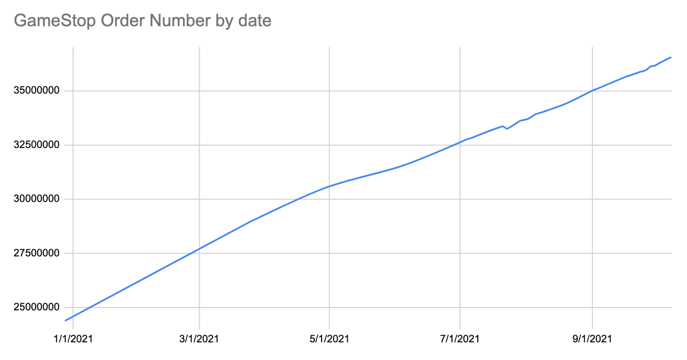
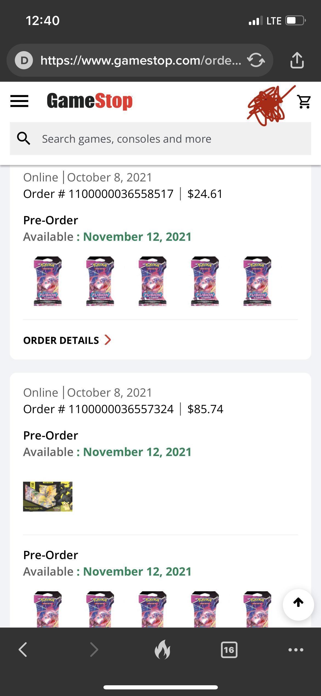

Hey everyone, I've been gathering data on GameStop order numbers to see what I might be able to uncovers. Thank you to all the helpful people that sent me their data as it helped add data points to smooth out the curve. The current data gap is Jan/Feb/May purchases.

Enough of the chit chat, let's get to it!

# GameStop isn't slowing down

Some quick notes on the chart:

1. The order numbers start with "11000000..." but I ommitted this for the charts viewability on the vertical axis bounds
2. You'll notice a small decrease in order numbers after 7/1/2021, I left the data point in there but I believe one of the data points I received might have had the order number typed slightly off.
3. The order number data seems to be sequential specific to country, so this data set is US only

**What does this chart mean?**

GameStop rate of orders have been almost constant all year long! There was a slight decline in May/June but this could also be due to lack of data points in those time frames. The rate of orders has actually had a recent uptick and I think it's related to a lot of the exclusive releases

**What about average spend?**

So honestly I thought this was going to be more interesting, but the data set looks extremely bonked. My GameStop purchases along with a couple others are causing the average spend in our data set to be hundreds of dollars! Apes are spending a lot of money at GameStop, but I don't think multiplying the average spend by order number differences is going to give us anything meaningful. For anyone that really wants that number, the average spend per order was $258.30.

# A Strategy Going Forward

I've thought about this a lot and I've made the decision that I will be making GameStop purchases every couple days going forward to get clean data. Purchasing online will make it easy to use GameStop as the database.

# Some last fun, Pokemon Fusion Strike exclusive GameStop release order data!

On 10/8/2021 was the 25th anniversary for Pokemon and if you've seen any of my DD, you know I have been talking about this. I jumped on for the pre-release and made 2 orders, one was about 15 minutes in and the other was only a minute or two later, no more than 5 minutes apart.

In the <5 minutes in-between orders, GameStop went from 1100000036557324 to 1100000036558517 which is 1193 online orders during that short release period. I'm kinda upset with myself for not making my purchases more strategically over that 1 hour period, but I have learned this lesson for the next exclusive release.

I hope you found this data fun and exciting. I'm jacked that GameStop isn't slowing down and if the average spend is actually increasing, well next quarters revenue will be another beat!
